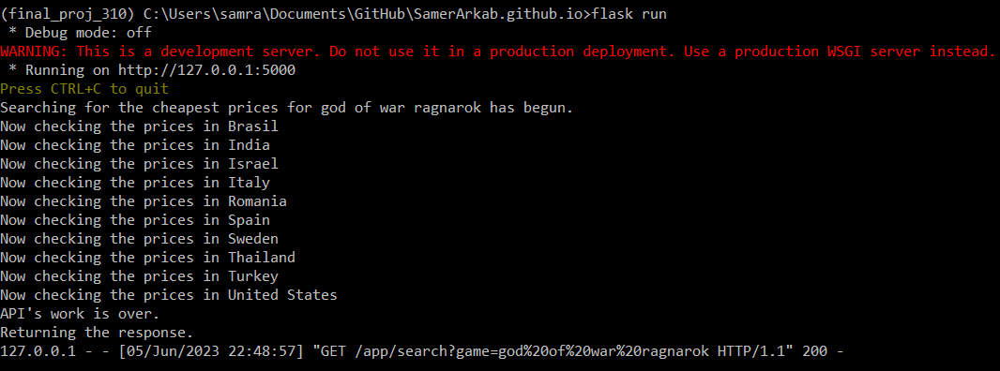

# PS Prices Worldwide
[GitHub Pages link](https://samerarkab.github.io/PSPricesWorldwide/)
  

### Table of contents
* [General Info](#general-info)
* [Important Info](#important-info)
* [Technologies](#technologies)
* [Setup](#setup)
* [Example run](#example-run)

#### General Info
Find the cheapest price in any country for your desired PlayStation game in the simplest and most efficient possible way using information retrieval techniques.
 This program will iterate through the PlayStation store website of 10 different countries, search for the user's desire game, retrieve the game's price, details and poster image.

#### Important Info
This website is hosted on GitHub-Pages which is a simple static file hosting service. In order to run this application using Flask you'll need to do the following:
- Download the files
- Run Flask server:
  - open Command Prompt
  - change directory to where the project's files are located
  - type "flask run" (All packages in #setup must be installed beforehand)
- Use the site by searching for your favorite games' prices :)

#### Technologies
* Python 3.9.6
* BeautifulSoup4 package
* requests package
* pandas package
* Flask-Cors package
* PyCharm IDE

#### Setup
* pip install beautifulsoup4
* pip install requests
* pip install pandas
* pip install Flask-Cors

#### Example run
  
 
