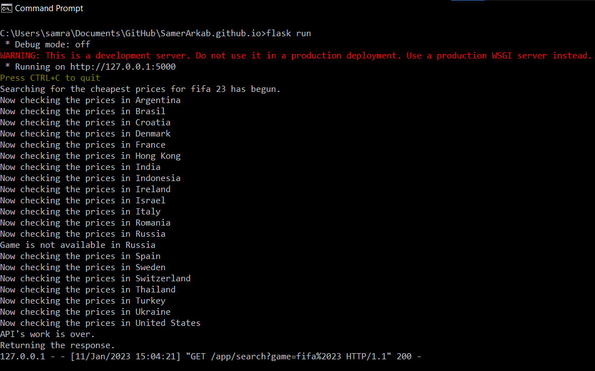
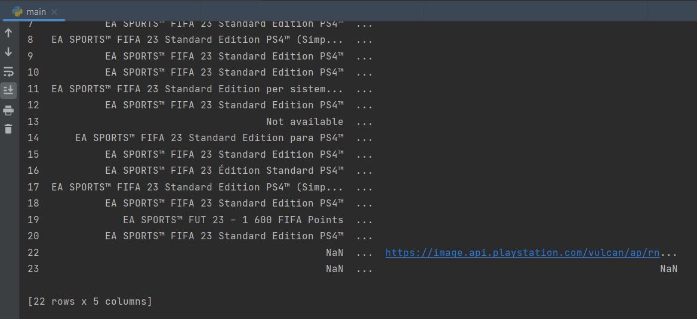

# IR-23 Group 9
[GitHub Pages link](https://samerarkab.github.io/)

### Table of contents
* [General info](#general-info)
* [Technologies](#technologies)
* [Setup](#setup)
* [Example run](#example-run)

#### General Info
Find the cheapest price in any country for your desired PlayStation game in the simplest and most efficient possible way using information retrieval techniques.
 This program will iterate through the PlayStation store website of 20 different countries, search for the user's desire game, retrieve the game's price, details and poster image.

#### Technologies
* Python 3.9.6
* BeautifulSoup4 package
* requests package
* pandas package
* PyCharm IDE

#### Setup
* pip install beautifulsoup4
* pip install requests
* pip install pandas

#### Example run
  
  
  
  
 
